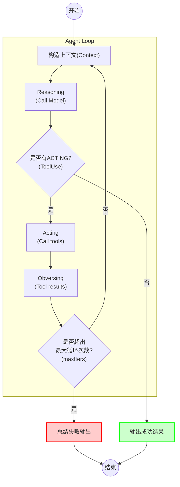
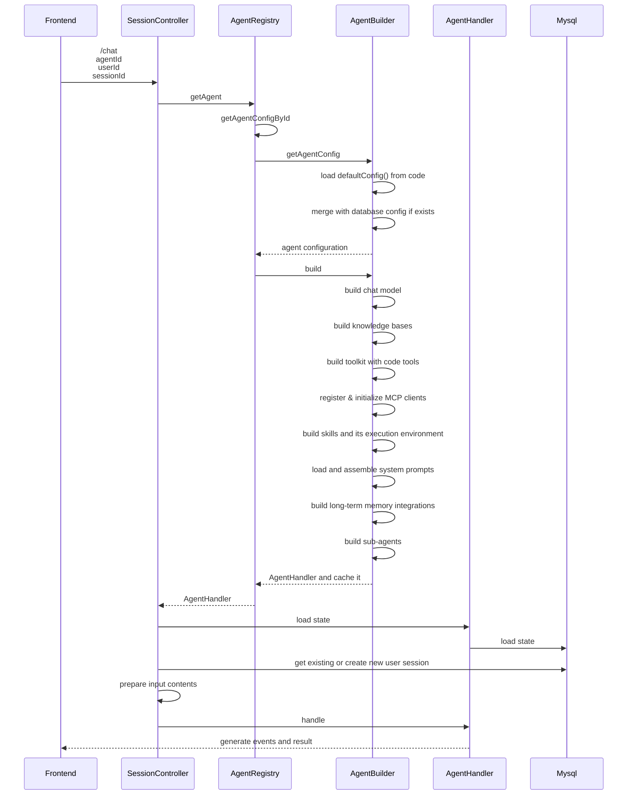
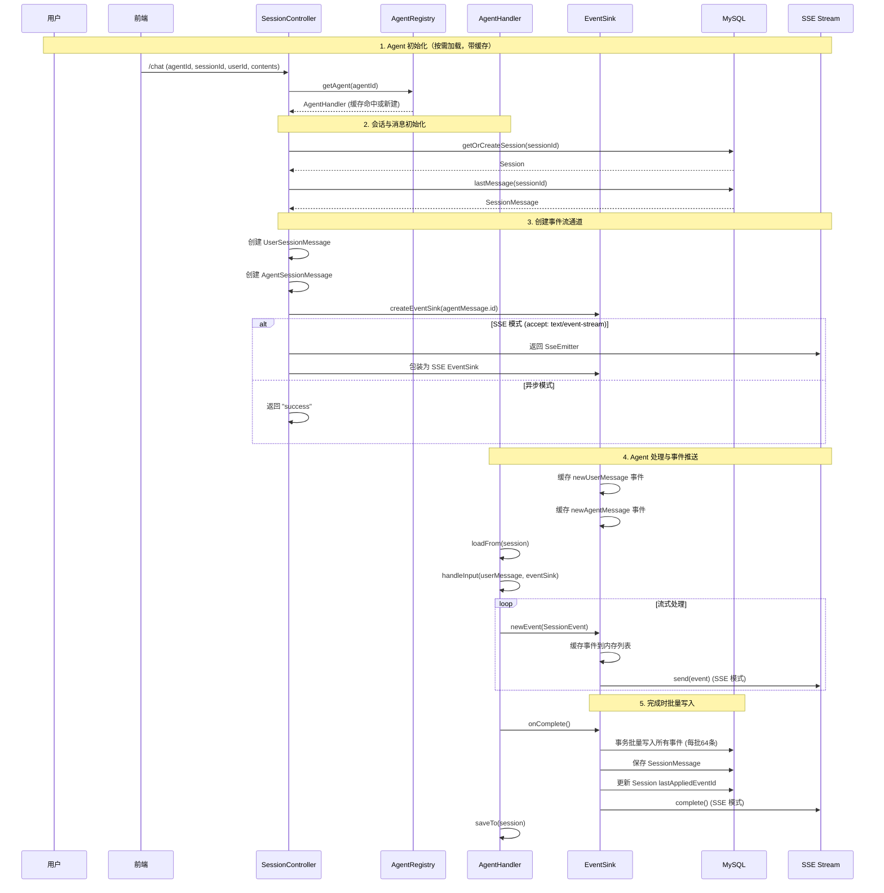

# 开发指南

## 目录

- [核心流程](#核心流程)
  - [ReAct Agent Loop](#react-agent-loop)
  - [Agent 初始化](#agent-初始化)
  - [异步事件流](#异步事件流)
  - [Chat 完整流程](#chat-完整流程)
- [API](#api)
  - [创建会话](#1-创建会话)
  - [获取会话列表](#2-获取会话列表)
  - [获取会话详情](#3-获取会话详情)
  - [删除会话](#4-删除会话)
  - [获取会话消息列表](#5-获取会话消息列表)
  - [获取会话事件列表](#6-获取会话事件列表)
  - [发起对话（核心 API）](#7-发起对话核心-api)
- [数据库表结构](#数据库表结构)
  - [sequences（序列号表）](#1-sequences序列号表)
  - [agents（Agent 配置表）](#2-agentsagent-配置表)
  - [agent_states（Agent 状态表）](#3-agent_statesagent-状态表)
  - [sessions（会话表）](#4-sessions会话表)
  - [messages（消息表）](#5-messages消息表)
  - [session_events（会话事件表）](#6-session_events会话事件表)
  - [mcp_clients（MCP 客户端配置表）](#7-mcp_clientsmcp-客户端配置表)
  - [knowledge_base_configs（知识库配置表）](#8-knowledge_base_configs知识库配置表)
  - [skill_configs（技能配置表）](#9-skill_configs技能配置表)
  - [files（文件表）](#10-files文件表)
  - [oss_files（OSS 文件映射表）](#11-oss_filesoss-文件映射表)
  - [Event Sourcing 数据流](#event-sourcing-数据流)
- [模型配置](#模型配置)
  - [支持的模型类型](#1-支持的模型类型)
  - [通过代码配置](#2-通过代码配置)
  - [使用 OpenAI 兼容接口](#3-使用-openai-兼容接口)
- [Tool开发&注册](#tool开发注册)
  - [创建 Tool 类](#1-创建-tool-类)
  - [注册到 ToolRegistry](#2-注册到-toolregistry)
  - [在 Agent 中启用 Tool](#3-在-agent-中启用-tool)
- [知识库集成](#知识库集成)
  - [内置支持：百炼知识库](#1-内置支持百炼知识库)
  - [在 Agent 中启用知识库](#2-在-agent-中启用知识库)
  - [RAG 模式说明](#3-rag-模式说明)
  - [扩展其他知识库](#4-扩展其他知识库)
- [长期记忆集成](#长期记忆集成)
  - [内置支持：百炼长期记忆](#1-内置支持百炼长期记忆)
  - [在 Agent 中启用长期记忆](#2-在-agent-中启用长期记忆)
  - [长期记忆模式](#3-长期记忆模式)
  - [配置记忆库 ID](#4-配置记忆库-id)
  - [扩展其他长期记忆](#5-扩展其他长期记忆)
- [MCP Server集成](#mcp-server集成)
  - [实现 McpConfigBuilder](#1-实现-mcpconfigbuilder)
  - [在 Agent 中启用 MCP](#2-在-agent-中启用-mcp)
  - [MCP 传输协议](#3-mcp-传输协议)
- [添加 Skills](#添加-skills)
  - [Skill 结构](#1-skill-结构)
  - [创建 SKILL.md](#2-创建-skillmd)
  - [创建执行脚本](#3-创建执行脚本)
  - [打包 Skill](#4-打包-skill)
  - [在 Agent 中启用 Skill](#5-在-agent-中启用-skill)
  - [Skill 与 Tool 的区别](#6-skill-与-tool-的区别)
- [多模态集成](#多模态集成)
  - [图片输入](#图片输入)
    - [接口定义](#1-接口定义)
    - [当前支持组件：OSS](#2-当前支持组件oss)
    - [扩展其他存储组件](#3-扩展其他存储组件)
  - [语音转文字（ASR）](#语音转文字asr)
    - [接口定义](#1-接口定义-1)
    - [当前支持组件：百炼 Qwen3-ASR-Flash-Realtime](#2-当前支持组件百炼-qwen3-asr-flash-realtime)
    - [扩展其他 ASR 组件](#3-扩展其他-asr-组件)
  - [文字转语音（TTS）](#文字转语音tts)
    - [接口定义](#1-接口定义-2)
    - [当前支持组件：百炼 Qwen3-TTS-Flash-Realtime](#2-当前支持组件百炼-qwen3-tts-flash-realtime)
    - [扩展其他 TTS 组件](#3-扩展其他-tts-组件)

---

## 核心流程

OneAgent最核心的流程是Chat，以下是一次对话过程（SSE API）中的不同阶段，详细解释一下相关的过程和原理。

### ReAct Agent Loop

结合Agentscope的ReAct Agent原理，描述其单次运行的流程。



注: 单次Agent调用可能会涉及到多轮循环，最终输出一个成功/失败的结果，OneAgent将其中Reasoning、Acting和Obersving的过程也通过异步事件的形式流式返回。

### Agent 初始化



- SessionController: 负责提供 /chat API，处理输入内容，驱动对话流程，返回响应(SSE)
- AgentRegistry: Agent注册表，负责管理并初始化应用内所有的Agent
- AgentBuilder：Agent构造器，负责加载Agent的配置，以及初始化AgentHandler
- AgentHandler：Agent实例，根据用户输入和智能体配置，产生流式输出和最终结果


### 异步事件流

OneAgent具备丰富的输入和输出内容支持，并且通过最多三层嵌套结构以灵活的支持不同的场景。


### Chat 完整流程



## API

OneAgent 提供运行时 API 用于会话管理和对话交互。

**基础路径**: `/api/agents/{agent_id}`（由 `server.servlet.context-path` 配置为 `/api`）

---

### 1. 创建会话

**Path**: `POST /agents/{agent_id}/sessions`

**用途**: 为指定 Agent 创建新会话

**路径参数**:

| 参数 | 类型 | 必填 | 说明 |
|------|------|------|------|
| agent_id | string | 是 | Agent ID |

**请求头**:

| 参数 | 类型 | 必填 | 说明 |
|------|------|------|------|
| X-User-Id | string | 是 | 用户 ID |

**请求体**:

| 字段 | 类型 | 必填 | 说明 |
|------|------|------|------|
| name | string | 是 | 会话名称 |

**返回值**: 会话 ID（字符串）

**示例**:

```bash
curl -X POST http://localhost:8080/api/agents/one_agent/sessions \
  -H "Content-Type: application/json" \
  -H "X-User-Id: test_user" \
  -d '{"name":"测试会话"}'
```

```json
"b6aa5fad7ff84271b59a897baa159d26"
```

### 2. 获取会话列表

**Path**: `GET /agents/{agent_id}/sessions`

**用途**: 分页获取用户的会话列表

**路径参数**:

| 参数 | 类型 | 必填 | 说明 |
|------|------|------|------|
| agent_id | string | 是 | Agent ID |

**请求头**:

| 参数 | 类型 | 必填 | 说明 |
|------|------|------|------|
| X-User-Id | string | 是 | 用户 ID |

**查询参数**:

| 参数 | 类型 | 必填 | 默认值 | 说明 |
|------|------|------|--------|------|
| pageNo | int | 否 | 1 | 页码（从 1 开始） |
| pageSize | int | 否 | 10 | 每页数量（1-100） |

**返回值**:

| 字段 | 类型 | 说明 |
|------|------|------|
| totalRecords | int | 总记录数 |
| records | array | 会话列表 |
| pageNum | int | 当前页码 |
| pageSize | int | 每页数量 |
| totalPages | int | 总页数 |

**示例**:

```bash
curl http://localhost:8080/api/agents/one_agent/sessions \
  -H "X-User-Id: test_user"
```

```json
{
  "totalRecords": 1,
  "records": [
    {
      "id": "b6aa5fad7ff84271b59a897baa159d26",
      "name": "测试会话",
      "lastAppliedEventId": 0,
      "gmtCreated": "2026-04-08 11:24:54",
      "gmtModified": "2026-04-08 11:24:54"
    }
  ],
  "pageNum": 1,
  "pageSize": 10,
  "totalPages": 1
}
```

### 3. 获取会话详情

**Path**: `GET /agents/{agent_id}/sessions/{session_id}`

**用途**: 获取指定会话的详细信息（包含消息列表）

**路径参数**:

| 参数 | 类型 | 必填 | 说明 |
|------|------|------|------|
| agent_id | string | 是 | Agent ID |
| session_id | string | 是 | 会话 ID |

**请求头**:

| 参数 | 类型 | 必填 | 说明 |
|------|------|------|------|
| X-User-Id | string | 是 | 用户 ID |

**返回值**: 会话详情（包含 messages 字段）

**示例**:

```bash
curl http://localhost:8080/api/agents/one_agent/sessions/b6aa5fad7ff84271b59a897baa159d26 \
  -H "X-User-Id: test_user"
```

```json
{
  "id": "b6aa5fad7ff84271b59a897baa159d26",
  "userId": "test_user",
  "agentId": "one_agent",
  "name": "测试会话",
  "lastAppliedEventId": 0,
  "gmtCreated": "2026-04-08 11:24:54",
  "gmtModified": "2026-04-08 11:24:54",
  "messages": {
    "totalRecords": 0,
    "records": [],
    "pageNum": 1,
    "pageSize": 10,
    "totalPages": 0
  }
}
```

### 4. 删除会话

**Path**: `DELETE /agents/{agent_id}/sessions/{session_id}`

**用途**: 删除指定会话

**路径参数**: 同上

**请求头**: 同上

### 5. 获取会话消息列表

**Path**: `GET /agents/{agent_id}/sessions/{session_id}/messages`

**用途**: 分页获取会话的消息列表

**查询参数**:

| 参数 | 类型 | 必填 | 默认值 | 说明 |
|------|------|------|--------|------|
| pageNo | int | 否 | 1 | 页码 |
| pageSize | int | 否 | 10 | 每页数量 |

**返回值**: 分页消息列表

### 6. 获取会话事件列表

**Path**: `GET /agents/{agent_id}/sessions/{session_id}/events`

**用途**: 分页获取会话的事件列表（Event Sourcing 模式）

**查询参数**:

| 参数 | 类型 | 必填 | 默认值 | 说明 |
|------|------|------|--------|------|
| offset | long | 否 | 0 | 偏移量 |
| size | int | 否 | 10 | 获取数量（1-100） |

**返回值**: 事件列表（SessionEvent 数组）

### 7. 发起对话（核心 API）

**Path**: `POST /agents/{agent_id}/sessions/{session_id}/chat`

**用途**: 向 Agent 发送消息并获取响应

**路径参数**:

| 参数 | 类型 | 必填 | 说明 |
|------|------|------|------|
| agent_id | string | 是 | Agent ID |
| session_id | string | 是 | 会话 ID |

**请求头**:

| 参数 | 类型 | 必填 | 说明 |
|------|------|------|------|
| X-User-Id | string | 是 | 用户 ID |
| X-User-Name | string | 否 | 用户名称 |
| Accept | string | 否 | 响应格式：`text/event-stream`（SSE 流式）或省略（异步） |

**请求体**:

| 字段 | 类型 | 必填 | 说明 |
|------|------|------|------|
| input | array | 是 | 输入内容列表 |

**input 数组元素**:

| 字段 | 类型 | 必填 | 说明 |
|------|------|------|------|
| type | int | 是 | 内容类型：1=文本，3=图片，4=视频，5=音频 |
| text | string | 条件 | 文本内容（type=1 时必填） |
| url | string | 条件 | 媒体 URL（type=3/4/5 时必填） |
| base64Data | string | 条件 | 媒体 Base64 数据（type=3/4/5 时可选） |

**响应模式**:

1. **SSE 流式模式**（推荐）: 设置 `Accept: text/event-stream`，返回 Server-Sent Events 流
2. **异步模式**: 不设置 Accept 头，立即返回 "success"，后台处理

**SSE 事件类型**:

- `NEW_USER_INPUT` (10): 用户输入事件
- `NEW_AGENT_MESSAGE` (20): 新 Agent 消息事件
- `AGENT_MESSAGE_APPEND_CONTENT` (21): Agent 消息内容追加
- `AGENT_MESSAGE_STATUS_CHANGED` (22): Agent 消息状态变更
- `TASK_APPEND_CONTENT` (30): 任务内容追加
- `TASK_STATUS_CHANGED` (31): 任务状态变更
- `ACTION_APPEND_CONTENT` (40): 动作内容追加
- `ACTION_STATUS_CHANGED` (41): 动作状态变更

**示例（SSE 模式）**:

```bash
curl -N -X POST http://localhost:8080/api/agents/one_agent/sessions/b6aa5fad7ff84271b59a897baa159d26/chat \
  -H "Content-Type: application/json" \
  -H "X-User-Id: test_user" \
  -H "Accept: text/event-stream" \
  -d '{"input":[{"type":1,"text":"你好"}]}'
```

**SSE 流输出示例**:

```
event:NEW_AGENT_MESSAGE
data:{"id":2,"agentId":"one_agent","userId":"test_user","sessionId":"b6aa5fad7ff84271b59a897baa159d26","msg":{"id":2,"status":"EXECUTING","gmtCreate":"2026-04-08 11:30:00"},"type":20}

event:AGENT_MESSAGE_APPEND_CONTENT
data:{"id":3,"agentId":"one_agent","userId":"test_user","sessionId":"b6aa5fad7ff84271b59a897baa159d26","messageId":2,"newContents":[{"id":1,"type":1,"text":"你好！"}],"type":21}

event:AGENT_MESSAGE_STATUS_CHANGED
data:{"id":4,"agentId":"one_agent","userId":"test_user","sessionId":"b6aa5fad7ff84271b59a897baa159d26","messageId":2,"newStatus":"SUCCEED","gmtFinished":"2026-04-08 11:30:05","type":22}
```

---

## 数据库表结构

OneAgent 使用 MySQL 数据库，采用 **Event Sourcing** 模式存储会话和事件数据。以下是所有表的详细说明。

---

### 1. sequences（序列号表）

**作用**: 全局唯一 ID 生成器，为事件、消息、任务等提供自增序列号

| 字段 | 类型 | 说明 |
|------|------|------|
| id | BIGINT UNSIGNED | 主键，自增 |
| name | SMALLINT | 序列名称（枚举值：EVENT=1, MESSAGE=2, TASK=3, ACTION=4） |
| current_value | BIGINT UNSIGNED | 当前序列值 |
| gmt_modified | TIMESTAMP | 修改时间 |
| gmt_created | TIMESTAMP | 创建时间 |

---

### 2. agents（Agent 配置表）

**作用**: 存储 Agent 的配置信息（可选，主要用于配置覆盖）

> 注：OneAgent 采用**纯代码配置**方式，Agent 的核心配置通过实现 `AgentBuilder` 接口在代码中定义。数据库中的 `agents` 表用于存储可选的配置覆盖，允许在运行时对代码配置进行微调。

| 字段 | 类型 | 说明 |
|------|------|------|
| id | BIGINT UNSIGNED | 主键，自增 |
| agent_id | VARCHAR(32) | Agent 唯一标识（如：one_agent） |
| name | VARCHAR(128) | Agent 显示名称 |
| enabled | TINYINT | 是否启用（1=启用，0=禁用） |
| type | SMALLINT | Agent 类型（1=普通 Agent，2=主 Agent） |
| config | MEDIUMTEXT | Agent 完整配置（JSON 格式，包含模型、工具、知识库等） |
| gmt_modified | TIMESTAMP | 修改时间 |
| gmt_created | TIMESTAMP | 创建时间 |

**样例数据**:

```json
{
  "id": 1,
  "agent_id": "one_agent",
  "name": "小AI",
  "enabled": 1,
  "type": 2,
  "config": "{\"chatModel\":{\"type\":2,\"modelName\":\"qwen3.6-plus\"},\"systemPrompt\":\"You are a helpful assistant.\",\"maxIters\":10,\"tools\":[],\"mcpClients\":[]}",
  "gmt_created": "2026-04-01 10:00:00"
}
```

---

### 3. agent_states（Agent 状态表）

**作用**: 存储 Agent 的会话状态，支持上下文持久化和恢复

| 字段 | 类型 | 说明 |
|------|------|------|
| id | BIGINT UNSIGNED | 主键，自增 |
| agent_id | VARCHAR(32) | Agent ID |
| user_id | VARCHAR(64) | 用户 ID |
| session_id | VARCHAR(64) | 会话 ID |
| data | MEDIUMTEXT | Agent 状态数据（JSON 格式，包含对话历史等） |
| gmt_modified | TIMESTAMP | 修改时间 |
| gmt_created | TIMESTAMP | 创建时间 |

**索引**: `uk_session_agent` (session_id, agent_id) - 唯一索引

**样例数据**:

```json
{
  "id": 1,
  "agent_id": "one_agent",
  "user_id": "user_001",
  "session_id": "sess_abc123",
  "data": "{\"messages\":[{\"role\":\"user\",\"content\":\"你好\"},{\"role\":\"assistant\",\"content\":\"你好！有什么可以帮助你的？\"}]}",
  "gmt_modified": "2026-04-08 11:30:00"
}
```

---

### 4. sessions（会话表）

**作用**: 存储会话基本信息，追踪会话的事件应用进度

| 字段 | 类型 | 说明 |
|------|------|------|
| id | BIGINT UNSIGNED | 主键，自增 |
| agent_id | VARCHAR(32) | Agent ID |
| user_id | VARCHAR(64) | 用户 ID |
| session_id | VARCHAR(64) | 会话唯一标识 |
| name | VARCHAR(128) | 会话名称（默认空字符串） |
| last_applied_event_id | BIGINT UNSIGNED | 最后应用的事件 ID（用于事件回放） |
| gmt_modified | TIMESTAMP | 修改时间 |
| gmt_created | TIMESTAMP | 创建时间 |

**索引**:
- `uk_session` (session_id, agent_id) - 唯一索引
- `idx_agent_user` (agent_id, user_id) - 普通索引，用于查询用户的会话列表

**样例数据**:

```json
{
  "id": 1,
  "agent_id": "one_agent",
  "user_id": "user_001",
  "session_id": "b6aa5fad7ff84271b59a897baa159d26",
  "name": "测试会话",
  "last_applied_event_id": 15,
  "gmt_created": "2026-04-08 11:24:54"
}
```

---

### 5. messages（消息表）

**作用**: 存储用户消息和 Agent 消息的快照（最终状态）

| 字段 | 类型 | 说明 |
|------|------|------|
| id | BIGINT UNSIGNED | 主键（从序列号表获取） |
| agent_id | VARCHAR(32) | Agent ID |
| user_id | VARCHAR(64) | 用户 ID |
| session_id | VARCHAR(64) | 会话 ID |
| type | SMALLINT | 消息类型（1=用户消息，2=Agent 消息） |
| status | SMALLINT | 消息状态（10=执行中，20=成功，30=失败） |
| data | MEDIUMTEXT | 消息完整内容（JSON 格式） |
| gmt_modified | TIMESTAMP | 修改时间 |
| gmt_created | TIMESTAMP | 创建时间 |

**索引**: `idx_session_id` (session_id, agent_id)

**样例数据**:

```json
{
  "id": 100,
  "agent_id": "one_agent",
  "user_id": "user_001",
  "session_id": "sess_abc123",
  "type": 1,
  "status": 20,
  "data": "{\"id\":100,\"contents\":[{\"type\":1,\"text\":\"你好\"}]}",
  "gmt_created": "2026-04-08 11:25:00"
}
```

---

### 6. session_events（会话事件表）

**作用**: Event Sourcing 核心表，存储所有会话事件的完整历史，支持事件回放和状态重建

| 字段 | 类型 | 说明 |
|------|------|------|
| id | BIGINT UNSIGNED | 主键（从序列号表获取） |
| agent_id | VARCHAR(32) | Agent ID |
| user_id | VARCHAR(64) | 用户 ID |
| session_id | VARCHAR(64) | 会话 ID |
| message_id | BIGINT UNSIGNED | 关联的消息 ID（可为 NULL） |
| type | SMALLINT | 事件类型（10=新用户输入，20=新 Agent 消息，21=消息内容追加，22=消息状态变更，30=任务内容追加，31=任务状态变更，40=动作内容追加，41=动作状态变更） |
| status | SMALLINT | 事件状态（仅状态变更事件使用） |
| data | MEDIUMTEXT | 事件完整数据（JSON 格式，包含事件的所有字段） |
| gmt_modified | TIMESTAMP | 修改时间 |
| gmt_created | TIMESTAMP | 创建时间 |

**索引**: `idx_session_id` (session_id, agent_id)

**样例数据**:

```json
{
  "id": 1,
  "agent_id": "one_agent",
  "user_id": "user_001",
  "session_id": "sess_abc123",
  "message_id": 100,
  "type": 20,
  "status": null,
  "data": "{\"id\":1,\"agentId\":\"one_agent\",\"userId\":\"user_001\",\"sessionId\":\"sess_abc123\",\"msg\":{\"id\":100,\"status\":\"EXECUTING\"},\"type\":20}",
  "gmt_created": "2026-04-08 11:25:00"
}
```

**事件类型说明**:

| 事件类型值 | 事件名称 | 说明 |
|-----------|---------|------|
| 10 | NEW_USER_INPUT | 用户输入事件 |
| 20 | NEW_AGENT_MESSAGE | 新 Agent 消息事件 |
| 21 | AGENT_MESSAGE_APPEND_CONTENT | Agent 消息内容追加（流式输出） |
| 22 | AGENT_MESSAGE_STATUS_CHANGED | Agent 消息状态变更 |
| 30 | TASK_APPEND_CONTENT | 子任务内容追加 |
| 31 | TASK_STATUS_CHANGED | 子任务状态变更 |
| 40 | ACTION_APPEND_CONTENT | 工具调用内容追加 |
| 41 | ACTION_STATUS_CHANGED | 工具调用状态变更 |

---

### 7. mcp_clients（MCP 客户端配置表）

**作用**: 存储 MCP（Model Context Protocol）客户端配置，支持动态添加外部工具服务

| 字段 | 类型 | 说明 |
|------|------|------|
| id | BIGINT UNSIGNED | 主键，自增 |
| mcp_id | VARCHAR(32) | MCP 客户端唯一标识 |
| name | VARCHAR(128) | MCP 客户端名称 |
| enabled | TINYINT | 是否启用（1=启用，0=禁用） |
| config | MEDIUMTEXT | MCP 配置（JSON 格式，包含传输方式、URL、超时等） |
| gmt_modified | TIMESTAMP | 修改时间 |
| gmt_created | TIMESTAMP | 创建时间 |

**样例数据**:

```json
{
  "id": 1,
  "mcp_id": "WebSearch",
  "name": "互联网搜索",
  "enabled": 1,
  "config": "{\"transport\":\"SSE\",\"url\":\"https://mcp.example.com/sse\",\"timeout\":30000}",
  "gmt_created": "2026-04-01 10:00:00"
}
```

---

### 8. knowledge_base_configs（知识库配置表）

**作用**: 存储知识库配置，支持 RAG（检索增强生成）功能

| 字段 | 类型 | 说明 |
|------|------|------|
| id | BIGINT UNSIGNED | 主键，自增 |
| knowledge_base_id | VARCHAR(32) | 知识库唯一标识 |
| name | VARCHAR(128) | 知识库名称 |
| enabled | TINYINT | 是否启用（1=启用，0=禁用） |
| config | MEDIUMTEXT | 知识库配置（JSON 格式，包含类型、索引 ID 等） |
| gmt_modified | TIMESTAMP | 修改时间 |
| gmt_created | TIMESTAMP | 创建时间 |

**样例数据**:

```json
{
  "id": 1,
  "knowledge_base_id": "kb_001",
  "name": "产品文档库",
  "enabled": 1,
  "config": "{\"type\":\"bailian\",\"workspaceId\":\"ws_123\",\"indexId\":\"idx_456\"}",
  "gmt_created": "2026-04-01 10:00:00"
}
```

---

### 9. skill_configs（技能配置表）

**作用**: 存储 Skill 配置，Skill 是可插拔的功能模块（如天气查询、代码执行等）

| 字段 | 类型 | 说明 |
|------|------|------|
| id | BIGINT UNSIGNED | 主键，自增 |
| name | VARCHAR(32) | 技能名称 |
| enabled | TINYINT | 是否启用（1=启用，0=禁用） |
| description | VARCHAR(1024) | 技能描述 |
| instruction | MEDIUMTEXT | 技能指令（Agent 使用技能的提示词） |
| base_dir | VARCHAR(1024) | 技能基础目录 |
| files | MEDIUMTEXT | 技能文件列表（JSON 格式） |
| file_id | BIGINT UNSIGNED | 关联的文件 ID（skills 表的 ZIP 包） |
| checksum | VARCHAR(1024) | 文件校验和 |
| gmt_modified | TIMESTAMP | 修改时间 |
| gmt_created | TIMESTAMP | 创建时间 |

**样例数据**:

```json
{
  "id": 1,
  "name": "weather",
  "enabled": 1,
  "description": "查询天气信息",
  "instruction": "当用户询问天气时，使用 weather 技能查询",
  "base_dir": "/skills/weather",
  "files": "[\"SKILL.md\", \"scripts/weather.py\"]",
  "file_id": 10,
  "checksum": "sha256:abc123...",
  "gmt_created": "2026-04-01 10:00:00"
}
```

---

### 10. files（文件表）

**作用**: 存储上传的文件内容（本地文件存储模式）

| 字段 | 类型 | 说明 |
|------|------|------|
| id | BIGINT UNSIGNED | 主键，自增 |
| name | VARCHAR(1024) | 文件名 |
| size | BIGINT | 文件大小（字节） |
| content | LONGBLOB | 文件二进制内容 |
| gmt_modified | TIMESTAMP | 修改时间 |
| gmt_created | TIMESTAMP | 创建时间 |

**索引**: `idx_name` (name(512))

**使用场景**: 存储 Skill 的 ZIP 包等小文件

---

### 11. oss_files（OSS 文件映射表）

**作用**: 存储阿里云 OSS 文件映射关系（云端文件存储模式）

| 字段 | 类型 | 说明 |
|------|------|------|
| id | BIGINT UNSIGNED | 主键（非自增，由应用生成） |
| user_id | VARCHAR(64) | 用户 ID |
| oss_region | VARCHAR(32) | OSS 区域（如：oss-cn-hangzhou） |
| oss_bucket | VARCHAR(32) | OSS Bucket 名称 |
| oss_file_key | VARCHAR(1024) | OSS 文件 Key（路径） |
| gmt_modified | TIMESTAMP | 修改时间 |
| gmt_created | TIMESTAMP | 创建时间 |

**索引**:
- `idx_user` (user_id) - 查询用户上传的文件
- `uk_oss_bucket_file_key` (oss_region, oss_bucket, oss_file_key) - 唯一索引，防止重复上传

**样例数据**:

```json
{
  "id": 1001,
  "user_id": "user_001",
  "oss_region": "oss-cn-hangzhou",
  "oss_bucket": "tron-agent-files",
  "oss_file_key": "users/user_001/skills/weather_v1.zip",
  "gmt_created": "2026-04-08 10:00:00"
}
```

---

### Event Sourcing 数据流 

OneAgent 采用 Event Sourcing 架构，核心数据流：

1. **事件写入**: 对话过程中，所有变化都以事件形式追加到内存缓存中，并在在 `onComplete` 时将事件批量写入 `session_events` 表
2. **消息快照**: 事件完成后，在 `onComplete` 时将消息最终状态写入 `messages` 表
3. **状态重建**: 通过回放 `session_events` 表中的事件，可以重建任意时刻的会话状态
4. **进度追踪**: `sessions.last_applied_event_id` 记录已应用的事件 ID，支持断点续传


## 模型配置

### 1. 支持的模型类型

OneAgent 支持两种模型配置方式：

| 类型 | 枚举值 | 说明 |
|------|--------|------|
| DASHSCOPE | 1 | 阿里云百炼 DashScope SDK |
| OPENAI_COMPATIBLE | 2 | OpenAI 兼容接口（可接入任意兼容 OpenAI API 格式的服务） |

### 2. 通过代码配置

继承 `BaseAgentBuilder` 类，在 `defaultConfig()` 方法中配置模型：

```java
@Component
public class MyAgentBuilder extends BaseAgentBuilder {
    public static final String AGENT_ID = "my_agent";

    @Value("${tron.dashscope.api-key}")
    private String apiKey;

    protected MyAgentBuilder() {
        super(AGENT_ID);
    }

    @Override
    protected AgentConfig defaultConfig() {
        return AgentConfig.builder()
                .name("我的智能助手")
                .enabled(true)
                .type(LocalAgentType.REACT)  // 或 LocalAgentType.ONE
                .chatModel(
                        ChatModelConfig.builder()
                                .type(ChatModelType.DASHSCOPE)  // 或 OPENAI_COMPATIBLE
                                .apiKey(apiKey)
                                .modelName("qwen3-max")  // 模型名称
                                .baseUrl(null)  // DASHSCOPE 类型不需要，OPENAI_COMPATIBLE 需要指定
                                .stream(true)  // 启用流式输出
                                .thinking(false)  // 是否启用深度思考
                                .build()
                )
                .systemPrompt("你是一个专业的AI助手，帮助用户解决问题。")
                .maxIters(10)  // 最大迭代次数
                .build();
    }
}
```

### 3. 使用 OpenAI 兼容接口

可以接入任何兼容 OpenAI API 格式的模型服务（如 Ollama、vLLM 等）：

```java
.chatModel(
        ChatModelConfig.builder()
                .type(ChatModelType.OPENAI_COMPATIBLE)
                .baseUrl("http://localhost:11434/v1")  // Ollama 本地服务
                .apiKey("ollama")  // 根据服务要求设置
                .modelName("qwen2.5:72b")  // 模型名称
                .stream(true)
                .build()
)
```

---

## Tool开发&注册

### 1. 创建 Tool 类

使用 AgentScope 的 `@Tool` 和 `@ToolParam` 注解定义工具：

```java
package com.example.tools;

import io.agentscope.core.tool.Tool;
import io.agentscope.core.tool.ToolParam;
import org.springframework.stereotype.Component;

@Component
public class WeatherTool {
    
    @Tool(description = "查询指定城市的天气信息")
    public String getWeather(
            @ToolParam(name = "city", description = "城市名称，如：北京、上海") String city
    ) {
        // 调用天气 API
        String weather = callWeatherAPI(city);
        return String.format("%s今天的天气：%s", city, weather);
    }
    
    @Tool(description = "计算两个城市之间的距离")
    public String calculateDistance(
            @ToolParam(name = "from", description = "出发城市") String from,
            @ToolParam(name = "to", description = "到达城市") String to
    ) {
        // 计算距离逻辑
        return String.format("从%s到%s的距离约为1000公里", from, to);
    }
}
```

### 2. 注册到 ToolRegistry

`ToolRegistry` 会自动扫描并注册所有带有 `@Component` 注解的 Tool 类：

```java
@Component
public class ToolRegistry {
    private final Toolkit toolkit = new Toolkit();
    
    @Autowired
    public ToolRegistry(List<Object> tools) {
        // 自动注册所有 Tool 类
        for (Object tool : tools) {
            toolkit.registration().tool(tool).apply();
        }
    }
    
    public Toolkit getAllTools() {
        return toolkit;
    }
}
```

**实际样例**：[CalculatorTool.java](../../backend_java/core/src/main/java/com/aliyun/tam/x/tron/core/tools/CalculatorTool.java)

```java
public class CalculatorTool {
    @Tool(description = "计算器工具，输入一个数学表达式，返回计算结果")
    public String calculator(
            @ToolParam(name = "expression", description = "数学表达式") String expression) {
        try {
            ExpressionParser parser = new SpelExpressionParser();
            EvaluationContext context = SimpleEvaluationContext.forReadOnlyDataBinding()
                    .withInstanceMethods()
                    .build();

            Expression exp = parser.parseExpression(expression);
            Object result = exp.getValue(context);
            return String.valueOf(result);
        } catch (Exception e) {
            return "计算错误: " + e.getMessage();
        }
    }
}
```

### 3. 在 Agent 中启用 Tool

在 Agent 配置中指定要使用的工具：

```java
@Override
protected AgentConfig defaultConfig() {
    return AgentConfig.builder()
            .name("智能助手")
            .enabled(true)
            .chatModel(/* ... */)
            .tools(Lists.newArrayList(
                    AgentToolConfig.builder()
                            .name("calculator")  // Tool 方法名
                            .enabled(true)
                            .build()
            ))
            .build();
}
```

---

## 知识库集成

### 1. 内置支持：百炼知识库

系统内置了阿里云百炼知识库的完整支持，使用 `BailianKnowledgeBaseConfig` 配置类。

**支持的配置项**：

| 配置项 | 类型 | 默认值 | 说明 |
|--------|------|--------|------|
| workspaceId | String | - | 百炼工作空间 ID |
| indexId | String | - | 百炼索引 ID |
| accessKeyId | String | - | 阿里云 AccessKey ID |
| accessKeySecret | String | - | 阿里云 AccessKey Secret |
| enableRewrite | Boolean | true | 是否启用查询改写 |
| rewriteModelName | String | - | 改写模型名称 |
| enableRerank | Boolean | true | 是否启用重排序 |
| rerankModelName | String | qwen3-rerank | 重排序模型 |
| rerankMinScore | Float | 0.2 | 重排序最低分数阈值 |
| rerankTopK | Integer | 5 | 重排序后返回 Top K |
| denseSimilarityTopK | Integer | 50 | 稠密向量检索 Top K |
| sparseSimilarityTopK | Integer | 50 | 稀疏向量检索 Top K |
| saveRetrieverHistory | Boolean | true | 是否保存检索历史 |

**使用示例**：

```java
package com.example.rag;

import com.aliyun.tam.x.tron.core.config.BailianKnowledgeBaseConfig;
import com.aliyun.tam.x.tron.core.config.KnowledgeBaseConfig;
import com.aliyun.tam.x.tron.core.rag.KnowledgeBaseConfigBuilder;
import org.springframework.beans.factory.annotation.Value;
import org.springframework.stereotype.Component;

@Component
public class MyKnowledgeBaseConfigBuilder implements KnowledgeBaseConfigBuilder {
    
    @Value("${tron.bailian.rag.access-key-id}")
    private String accessKeyId;

    @Value("${tron.bailian.rag.access-key-secret}")
    private String accessKeySecret;

    @Override
    public String getId() {
        return "product_docs";
    }

    @Override
    public KnowledgeBaseConfig getConfig() {
        return BailianKnowledgeBaseConfig.builder()
                .id(getId())
                .name("产品文档知识库")
                .accessKeyId(accessKeyId)
                .accessKeySecret(accessKeySecret)
                .workspaceId("your_workspace_id")
                .indexId("your_index_id")
                .enableRewrite(true)
                .enableRerank(true)
                .rerankModelName("qwen3-rerank")
                .rerankTopK(5)
                .build();
    }
}
```

**实际样例**：[ExampleKnowledgeBaseConfigBuilder.java](../../backend_java/core/src/main/java/com/aliyun/tam/x/tron/core/rag/ExampleKnowledgeBaseConfigBuilder.java)

### 2. 在 Agent 中启用知识库

```java
@Override
protected AgentConfig defaultConfig() {
    return AgentConfig.builder()
            .name("RAG 助手")
            .enabled(true)
            .chatModel(/* ... */)
            .ragMode("AGENTIC")  // 或 "GENERIC"
            .knowledgeBases(Lists.newArrayList(
                    AgentKnowledgeBaseConfig.builder()
                            .knowledgeId("my_knowledge_base")
                            .enabled(true)
                            .mode("generic")  // generic 或 agentic
                            .defaultLimit(10)
                            .defaultScoreThreshold(0.7)
                            .build()
            ))
            .build();
}
```

### 3. RAG 模式说明

| 模式 | 说明 |
|------|------|
| GENERIC | 通用模式：在每次对话前自动检索知识库，将检索结果注入上下文 |
| AGENTIC | 智能体模式：Agent 自主决定何时使用知识库检索工具 |

### 4. 扩展其他知识库

系统通过 `KnowledgeBaseConfigBuilder` 接口实现知识库的可扩展性：

```java
public interface KnowledgeBaseConfigBuilder {
    /**
     * 获取知识库唯一标识
     */
    String getId();

    /**
     * 获取知识库配置
     */
    KnowledgeBaseConfig getConfig();
}
```

**扩展示例（以自定义向量数据库为例）**：

```java
@Component
@ConditionalOnProperty(name = "knowledge.base.type", havingValue = "custom_vector_db")
public class CustomVectorKnowledgeBaseBuilder implements KnowledgeBaseConfigBuilder {

    @Value("${knowledge.base.custom.url}")
    private String url;

    @Value("${knowledge.base.custom.api-key}")
    private String apiKey;

    @Override
    public String getId() {
        return "custom_vector_db";
    }

    @Override
    public KnowledgeBaseConfig getConfig() {
        return CustomVectorKnowledgeBaseConfig.builder()
                .id(getId())
                .name("自定义向量知识库")
                .url(url)
                .apiKey(apiKey)
                .collectionName("my_collection")
                .embeddingModel("text-embedding-3-small")
                .topK(10)
                .build();
    }
}
```

**关键要点**：

1. 创建自定义的 `KnowledgeBaseConfig` 子类，定义配置字段
2. 实现 `KnowledgeBaseConfigBuilder` 接口
3. 使用 `@ConditionalOnProperty` 实现条件加载
4. 在 `KnowledgeRegistry.buildKnowledge()` 方法中添加对新配置类型的支持
5. 实现 `Knowledge` 接口，提供实际的检索逻辑

---

## 长期记忆集成

### 1. 内置支持：百炼长期记忆

系统内置了阿里云百炼长期记忆的完整支持，使用 `BailianLongTermMemoryFactory` 实现类。

**工作原理**：

1. 用户发送消息时，系统自动将用户消息保存到百炼记忆库
2. 每次对话前，根据当前查询从百炼记忆库检索相关历史记忆
3. 检索到的记忆注入到 Agent 上下文中，帮助 Agent 记住用户偏好和历史
4. 支持跨会话的长期记忆，实现真正的个性化对话

**配置参数**：

| 配置项 | 类型 | 默认值 | 说明 |
|--------|------|--------|------|
| memory_library_id | String | - | 百炼记忆库 ID（必填） |
| apiKey | String | ${DASHSCOPE_API_KEY} | 百炼 API Key |

**使用示例**：

```java
package com.example.mem;

import com.aliyun.tam.x.tron.core.mem.LongTermMemoryFactory;
import io.agentscope.core.memory.LongTermMemory;
import io.agentscope.core.message.Msg;
import io.agentscope.core.message.MsgRole;
import org.springframework.beans.factory.annotation.Value;
import org.springframework.stereotype.Component;
import org.springframework.util.StringUtils;
import org.springframework.web.client.RestClient;

import java.util.List;
import java.util.Map;

@Component
public class BailianLongTermMemoryFactory implements LongTermMemoryFactory {

    @Value("${tron.dashscope.api-key}")
    private String apiKey;

    @Value("${memory.long.bailian.memory_library_id:}")
    private String memoryLibraryId;

    @Override
    public LongTermMemory create(String userId) {
        if (!StringUtils.hasText(memoryLibraryId)) {
            return null;  // 未配置记忆库 ID，不启用长期记忆
        }
        
        return new LongTermMemory() {
            private final RestClient client = RestClient.builder()
                    .baseUrl("https://dashscope.aliyuncs.com/api/v1")
                    .defaultHeader("Authorization", "Bearer " + apiKey)
                    .build();

            @Override
            public Mono<List<Msg>> retrieve(Msg query, int limit) {
                // 从百炼记忆库检索相关记忆
                Map<String, Object> requestBody = ImmutableMap.of(
                        "memory_library_id", memoryLibraryId,
                        "user_id", userId,
                        "query", query.getTextContent().orElse(""),
                        "limit", limit
                );

                return Mono.fromCallable(() -> {
                    var response = client.post()
                            .uri("/memories/retrieve")
                            .contentType(MediaType.APPLICATION_JSON)
                            .body(requestBody)
                            .retrieve()
                            .body(String.class);
                    return parseMemories(response);
                });
            }

            @Override
            public Mono<Void> addMessage(Msg message) {
                // 只保存用户消息到记忆库
                if (message.getRole() == MsgRole.USER) {
                    return saveToMemoryLibrary(userId, message);
                }
                return Mono.empty();
            }
        };
    }
}
```

**实际样例**：[BailianLongTermMemoryFactory.java](../../backend_java/core/src/main/java/com/aliyun/tam/x/tron/core/mem/BailianLongTermMemoryFactory.java)

### 2. 在 Agent 中启用长期记忆

```java
@Override
protected AgentConfig defaultConfig() {
    return AgentConfig.builder()
            .name("记忆助手")
            .enabled(true)
            .chatModel(/* ... */)
            .enableLongTermMemory(true)  // 启用长期记忆
            .longTermMemoryMode("BOTH")  // RECALL（检索）或 WRITE（写入）或 BOTH
            .build();
}
```

### 4. 长期记忆模式

| 模式 | 说明 |
|------|------|
| RECALL | 仅检索：在对话中检索历史记忆，但不写入新记忆 |
| WRITE | 仅写入：写入新记忆，但不检索 |
| BOTH | 双向：既检索又写入（推荐） |

### 5. 配置记忆库 ID

在 `application.yaml` 中配置：

```yaml
memory:
  long:
    bailian:
      memory_library_id: "your_memory_library_id"
```

### 6. 扩展其他长期记忆

系统通过 `LongTermMemoryFactory` 接口实现长期记忆的可扩展性：

```java
public interface LongTermMemoryFactory {
    /**
     * 创建长期记忆实例
     * @param userId 用户 ID
     * @return 长期记忆实例
     */
    LongTermMemory create(String userId);
}
```

**AgentScope 的 LongTermMemory 接口**：

```java
public interface LongTermMemory {
    /**
     * 检索相关记忆
     * @param query 查询消息
     * @param limit 返回数量限制
     * @return 相关记忆列表
     */
    Mono<List<Msg>> retrieve(Msg query, int limit);

    /**
     * 添加消息到长期记忆
     * @param message 消息
     * @return 异步结果
     */
    Mono<Void> addMessage(Msg message);
}
```

**扩展示例（以 Redis 为例）**：

```java
@Component
@ConditionalOnProperty(name = "memory.long.type", havingValue = "redis")
public class RedisLongTermMemoryFactory implements LongTermMemoryFactory {

    @Value("${memory.long.redis.url}")
    private String redisUrl;

    @Value("${memory.long.redis.max-messages:100}")
    private int maxMessages;

    private final RedisClient redisClient;

    public RedisLongTermMemoryFactory() {
        // 初始化 Redis 客户端
        this.redisClient = RedisClient.create(redisUrl);
    }

    @Override
    public LongTermMemory create(String userId) {
        return new LongTermMemory() {
            private final String memoryKey = "user:" + userId + ":memory";

            @Override
            public Mono<List<Msg>> retrieve(Msg query, int limit) {
                return Mono.fromCallable(() -> {
                    // 从 Redis 获取最近的消息
                    List<String> messages = redisClient.lrange(memoryKey, 0, limit - 1);
                    return messages.stream()
                            .map(json -> Msg.fromJson(json))
                            .collect(Collectors.toList());
                });
            }

            @Override
            public Mono<Void> addMessage(Msg message) {
                return Mono.fromRunnable(() -> {
                    // 将消息添加到 Redis 列表
                    redisClient.lpush(memoryKey, message.toJson());
                    // 限制列表长度
                    redisClient.ltrim(memoryKey, 0, maxMessages - 1);
                });
            }
        };
    }
}
```

**配置类**：

```java
@ConditionalOnProperty(name = "memory.long.type", havingValue = "redis")
@EnableConfigurationProperties(RedisLongTermMemoryConfig.RedisLongTermMemoryProperties.class)
public class RedisLongTermMemoryConfig {

    @Data
    @ConfigurationProperties("memory.long.redis")
    public static class RedisLongTermMemoryProperties {
        private String url = "redis://localhost:6379";
        private int maxMessages = 100;
    }

    @Bean
    public RedisLongTermMemoryFactory redisLongTermMemoryFactory(
            RedisLongTermMemoryProperties properties) {
        return new RedisLongTermMemoryFactory(properties);
    }
}
```

**关键要点**：

1. 实现 `LongTermMemoryFactory` 接口，返回 `LongTermMemory` 实例
2. 使用 `@ConditionalOnProperty` 实现条件加载
3. 创建配置类注册 Bean
4. `retrieve()` 方法实现记忆检索逻辑（可以基于向量相似度、时间等）
5. `addMessage()` 方法实现记忆存储逻辑
6. 在 `application.yml` 中配置 `memory.long.type=redis` 即可切换

---

## MCP Server集成

### 1. 实现 McpConfigBuilder

创建 MCP 客户端配置构建器：

```java
package com.example.mcp;

import com.aliyun.tam.x.tron.core.config.McpClientConfig;
import com.aliyun.tam.x.tron.core.mcp.McpConfigBuilder;
import com.google.common.collect.ImmutableMap;
import org.springframework.beans.factory.annotation.Value;
import org.springframework.stereotype.Component;

@Component
public class CustomMcpConfigBuilder implements McpConfigBuilder {
    
    @Value("${custom.mcp.api-key}")
    private String apiKey;

    @Override
    public String getId() {
        return "my_mcp_server";
    }

    @Override
    public McpClientConfig getConfig() {
        return McpClientConfig.builder()
                .id(getId())
                .name("我的MCP服务")
                .description("提供XXX功能的MCP服务")
                .transport(McpClientConfig.TRANSPORT_HTTP)  // 或 TRANSPORT_SSE
                .url("https://your-mcp-server.com/mcp")
                .timeout(30)  // 请求超时（秒）
                .initializeTimeout(10)  // 初始化超时（秒）
                .headers(ImmutableMap.of(
                        "Authorization", "Bearer " + apiKey,
                        "Content-Type", "application/json"
                ))
                .build();
    }
}
```

**实际样例**：[WebSearchMcpConfigBuilder.java](../../backend_java/core/src/main/java/com/aliyun/tam/x/tron/core/mcp/WebSearchMcpConfigBuilder.java)

```java
@Component
public class WebSearchMcpConfigBuilder implements McpConfigBuilder {

    @Value("${tron.dashscope.api-key}")
    private String apiKey;

    @Override
    public String getId() {
        return "WebSearch";
    }

    @Override
    public McpClientConfig getConfig() {
        return McpClientConfig.builder()
                .id(getId())
                .name("阿里云百炼_联网搜索")
                .description("基于通义实验室多种检索模型，提供实时互联网全栈信息检索")
                .transport(McpClientConfig.TRANSPORT_HTTP)
                .url("https://dashscope.aliyuncs.com/api/v1/mcps/WebSearch/mcp")
                .headers(ImmutableMap.of(
                        "Authorization", "Bearer " + apiKey
                ))
                .build();
    }
}
```

### 2. 在 Agent 中启用 MCP

```java
@Override
protected AgentConfig defaultConfig() {
    return AgentConfig.builder()
            .name("MCP 助手")
            .enabled(true)
            .chatModel(/* ... */)
            .mcpClients(Lists.newArrayList(
                    AgentMcpConfig.builder()
                            .clientId("WebSearch")
                            .enabled(true)
                            .enableFuncs(Lists.newArrayList("search", "fetch"))  // 可选：启用特定函数
                            .disableFuncs(Lists.newArrayList())  // 可选：禁用特定函数
                            .build()
            ))
            .build();
}
```

---

| 协议 | 常量 | 说明 |
|------|------|------|
| HTTP | `http` | Streamable HTTP 传输（推荐） |
| SSE | `sse` | Server-Sent Events 传输 |

---

## 添加 Skills

### 1. Skill 结构

Skill 是一个可插拔的功能模块，包含以下文件：

```
skills/weather/
├── SKILL.md              # Skill 描述文件（必需）
└── scripts/
    └── weather.py        # 执行脚本（可选）
```

### 2. 创建 SKILL.md

**实际样例**：[SKILL.md](../../backend_java/skills/weather/SKILL.md)

```markdown
---
name: weather
description: 用于查询某地的今天天气
---

# 天气查询技能

执行以下Python代码以获取某个城市的天气信息，其中 <<city>> 为城市名称

```shell
python3 scripts/weather.py <<city>>
```

# Input Parameters
- city: 城市名称

# Examples
---

### 3. 创建执行脚本

**实际样例**：[weather.py](../../backend_java/skills/weather/scripts/weather.py)

```python
import sys
import requests
from urllib.parse import quote

resp = requests.get(
    f"https://uapis.cn/api/v1/misc/weather?city={quote(sys.argv[1])}"
)

resp.raise_for_status()
data = resp.json()
print(f"{data['city']}今天的天气{data['weather']}，当前气温为{data['temperature']}摄氏度")
```

### 4. 打包 Skill

将 Skill 目录打包为 ZIP 文件：

```bash
cd skills/weather
zip -r weather.zip SKILL.md scripts/
```

> 注：Skill 需要通过 API 上传，系统会将 ZIP 包存储到文件系统中，并在 Agent 配置中启用。

### 5. 在 Agent 中启用 Skill

```java
@Override
protected AgentConfig defaultConfig() {
    return AgentConfig.builder()
            .name("旅行助手")
            .enabled(true)
            .chatModel(/* ... */)
            .skills(Lists.newArrayList(
                    AgentSkillConfig.builder()
                            .name("weather")  // Skill 名称
                            .enabled(true)
                            .build()
            ))
            .build();
}
```

### 7. Skill 与 Tool 的区别

| 特性 | Tool | Skill |
|------|------|-------|
| 实现方式 | Java 代码，使用 @Tool 注解 | Markdown 描述 + 任意脚本 |
| 注册方式 | 自动扫描 @Component 类 | 上传 ZIP 包 |
| 执行方式 | 直接调用 Java 方法 | Agent 读取 SKILL.md 并执行脚本 |
| 适用场景 | 复杂逻辑、需要类型安全 | 快速集成、脚本工具 |
| 代码执行 | 不依赖外部进程 | 需要代码执行环境（Python 等） |

## 多模态集成

### 图片输入

#### 1. 接口定义

**上传文件**：`POST /api/file`

**请求头**：

| 参数 | 类型 | 必填 | 说明 |
|------|------|------|------|
| X-User-Id | string | 是 | 用户 ID |
| Content-Type | string | 是 | multipart/form-data |

**请求体**：

| 参数 | 类型 | 必填 | 说明 |
|------|------|------|------|
| file | MultipartFile | 是 | 图片文件（支持 jpg、jpeg、png） |

**返回值**：HTTP 201 Created，Location 头包含文件访问 URL

**获取文件**：`GET /api/file/{id}`

**路径参数**：

| 参数 | 类型 | 必填 | 说明 |
|------|------|------|------|
| id | long | 是 | 文件 ID |

**返回值**：302 重定向到文件实际地址（OSS 预签名 URL）

#### 2. 当前支持组件：OSS

系统使用阿里云 OSS 作为图片存储后端，实现类为 `OssStorageProvider`。

**配置方式**：

```yaml
tron:
  file:
    provider:
      type: oss  # 存储提供者类型
  oss:
    bucket: your-bucket-name
    region: oss-cn-hangzhou
    endpoint: oss-cn-hangzhou.aliyuncs.com
    access-key-id: ${OSS_ACCESS_KEY_ID}
    access-key-secret: ${OSS_ACCESS_KEY_SECRET}
```

**工作原理**：

1. 前端通过 `POST /api/file` 上传图片（multipart/form-data）
2. 后端将文件上传到 OSS，路径格式：`tron/{userId}/{fileId}.{suffix}`
3. 文件 ID 存入 `oss_files` 表
4. 返回文件访问 URL：`/api/file/{id}`
5. 访问时生成 OSS 预签名 URL（有效期 2 小时）并 302 重定向
6. 前端在聊天消息中使用该 URL 作为图片输入

**支持的图片格式**：jpg、jpeg、png

#### 3. 扩展其他存储组件

系统通过 `StorageProvider` 接口实现存储后端的可扩展性：

```java
public interface StorageProvider {
    /**
     * 上传文件
     * @param userId 用户 ID
     * @param suffix 文件后缀
     * @param is 文件输入流
     * @return 文件 ID
     */
    Long upload(String userId, String suffix, InputStream is) throws IOException;

    /**
     * 获取文件（返回 ResponseEntity）
     */
    ResponseEntity<?> get(String userId, Long id);

    /**
     * 转换为公开 URL
     */
    default String toPublicUrl(String userId, String url) {
        return url;
    }
}
```

**扩展示例（以本地文件系统为例）**：

```java
@Component
@ConditionalOnProperty(name = "tron.file.provider.type", havingValue = "local")
public class LocalStorageProvider implements StorageProvider {

    @Value("${tron.file.local.base-path:/tmp/tron-files}")
    private String basePath;

    @Override
    public Long upload(String userId, String suffix, InputStream is) throws IOException {
        long id = System.currentTimeMillis();
        Path filePath = Paths.get(basePath, userId, id + "." + suffix);
        Files.createDirectories(filePath.getParent());
        Files.copy(is, filePath, StandardCopyOption.REPLACE_EXISTING);
        return id;
    }

    @Override
    public ResponseEntity<?> get(String userId, Long id) {
        try {
            Path filePath = Paths.get(basePath, userId, id + ".*");
            // 使用通配符查找文件
            Path actualPath = findFile(filePath);
            if (actualPath == null || !Files.exists(actualPath)) {
                return ResponseEntity.notFound().build();
            }
            byte[] content = Files.readAllBytes(actualPath);
            return ResponseEntity.ok()
                    .contentType(MediaType.IMAGE_JPEG)
                    .body(content);
        } catch (IOException e) {
            return ResponseEntity.internalServerError().build();
        }
    }
}
```

**关键要点**：

1. 使用 `@ConditionalOnProperty` 实现条件加载
2. 实现 `StorageProvider` 接口的两个核心方法
3. 在 `application.yml` 中配置 `tron.file.provider.type=local` 即可切换

---

### 语音转文字（ASR）

#### 1. 接口定义

**WebSocket 端点**：`ws://host:port/api/asr`

**客户端 → 服务端消息格式**：

```json
{
  "dataBase64": "音频数据的 Base64 编码（PCM 格式）",
  "completed": false
}
```

| 字段 | 类型 | 必填 | 说明 |
|------|------|------|------|
| dataBase64 | string | 否 | Base64 编码的 PCM 音频数据（16kHz, 16bit, 单声道） |
| completed | boolean | 否 | 是否完成录音，默认 false |

**服务端 → 客户端消息格式**：

```json
{
  "success": true,
  "text": "识别出的文字",
  "finished": false,
  "error": null
}
```

| 字段 | 类型 | 必填 | 说明 |
|------|------|------|------|
| success | boolean | 是 | 是否成功 |
| text | string | 否 | 识别结果文本（中间结果或最终结果） |
| finished | boolean | 是 | 是否识别完成 |
| error | string | 否 | 错误信息 |

#### 2. 当前支持组件：百炼 Qwen3-ASR-Flash-Realtime

系统使用阿里云百炼平台的 Qwen3-ASR-Flash-Realtime 模型进行实时语音识别。

**配置方式**：

```yaml
asr:
  type: qwen  # ASR 提供者类型
  qwen:
    model: qwen3-asr-flash-realtime
    url: wss://dashscope.aliyuncs.com/api-ws/v1/realtime
    apiKey: ${DASHSCOPE_API_KEY}  # 百炼 API Key
    language: zh  # 识别语言
    inputSampleRate: 16000  # 输入采样率
    inputAudioFormat: pcm  # 输入音频格式
    sessionCreateTimeoutInMills: 10000  # 会话创建超时（毫秒）
```

**工作原理**：

1. 前端通过 `navigator.mediaDevices.getUserMedia` 获取麦克风权限
2. 使用 `AudioContext` 和 `ScriptProcessorNode` 捕获 16kHz PCM 音频
3. 建立 WebSocket 连接到 `/api/asr`
4. 将音频分片（1024 采样点）转为 Base64 并通过 WebSocket 发送
5. 后端通过 `AsrWsEndpoint` 接收音频数据
6. 后端调用百炼 Qwen3-ASR 实时模型进行识别
7. 实时返回识别结果（中间结果和最终结果）
8. 用户松开麦克风时发送 `completed: true`，返回最终结果

**音频格式要求**：

- 采样率：16000 Hz
- 位深度：16 bit
- 声道数：单声道（Mono）
- 编码格式：PCM
- 传输格式：Base64 编码

#### 3. 扩展其他 ASR 组件

系统通过 `AsrService` 和 `AsrSession` 接口实现 ASR 服务的可扩展性：

```java
public interface AsrService {
    interface AsrCallback {
        void onText(String text);      // 识别结果回调
        void onFinished();              // 完成回调
        void onError(Throwable t);      // 错误回调
    }

    AsrSession newSession(AsrCallback callback);
}

public interface AsrSession {
    void appendData(String dataBase64);  // 追加音频数据
    void complete();                      // 标记完成
    void close();                         // 关闭会话
}
```

**扩展示例（以科大讯飞为例）**：

```java
@Component
@ConditionalOnProperty(name = "asr.type", havingValue = "iflytek")
public class IflytekAsrService implements AsrService {

    @Value("${asr.iflytek.app-id}")
    private String appId;

    @Value("${asr.iflytek.api-key}")
    private String apiKey;

    @Override
    public AsrSession newSession(AsrCallback callback) {
        // 1. 建立与科大讯飞的 WebSocket 连接
        // 2. 配置识别参数
        // 3. 实现回调转发
        
        return new AsrSession() {
            @Override
            public void appendData(String dataBase64) {
                // 将 Base64 音频数据发送给科大讯飞
            }

            @Override
            public void complete() {
                // 发送完成信号
            }

            @Override
            public void close() {
                // 关闭 WebSocket 连接
            }
        };
    }
}
```

**配置类**：

```java
@ConditionalOnProperty(name = "asr.type", havingValue = "iflytek")
@EnableConfigurationProperties(IflytekAsrConfig.IflytekAsrProperties.class)
public class IflytekAsrConfig {

    @Data
    @ConfigurationProperties("asr.iflytek")
    public static class IflytekAsrProperties {
        private String appId;
        private String apiKey;
        private String apiSecret;
        private String language = "zh_cn";
    }

    @Bean
    public IflytekAsrService iflytekAsrService(IflytekAsrProperties properties) {
        return new IflytekAsrService(properties);
    }
}
```

**关键要点**：

1. 实现 `AsrService` 和 `AsrSession` 接口
2. 使用 `@ConditionalOnProperty` 实现条件加载
3. 创建配置类注册 Bean
4. 在 `application.yml` 中配置 `asr.type=iflytek` 即可切换
5. 音频格式要求：16kHz PCM 16bit 单声道

---

### 文字转语音（TTS）

#### 1. 接口定义

**WebSocket 端点**：`ws://host:port/api/tts`

**客户端 → 服务端消息格式**：

```json
{
  "text": "要转换为语音的文本",
  "completed": false
}
```

| 字段 | 类型 | 必填 | 说明 |
|------|------|------|------|
| text | string | 否 | 要合成的文本内容 |
| completed | boolean | 否 | 是否文本流完成，默认 false |

**服务端 → 客户端消息格式**：

```json
{
  "success": true,
  "dataBase64": "音频数据的 Base64 编码（PCM 格式）",
  "finished": false,
  "error": null
}
```

| 字段 | 类型 | 必填 | 说明 |
|------|------|------|------|
| success | boolean | 是 | 是否成功 |
| dataBase64 | string | 否 | Base64 编码的 PCM 音频数据 |
| finished | boolean | 是 | 是否合成完成 |
| error | string | 否 | 错误信息 |

#### 2. 当前支持组件：百炼 Qwen3-TTS-Flash-Realtime

系统使用阿里云百炼平台的 Qwen3-TTS-Flash-Realtime 模型进行实时语音合成。

**配置方式**：

```yaml
tts:
  type: qwen  # TTS 提供者类型
  qwen:
    model: qwen3-tts-flash-realtime
    url: wss://dashscope.aliyuncs.com/api-ws/v1/realtime
    apiKey: ${DASHSCOPE_API_KEY}  # 百炼 API Key
    voice: Cherry  # 音色名称
    languageType: Auto  # 语言类型（Auto/Chinese/English）
    mode: server_commit  # 模式
    format: PCM_24000HZ_MONO_16BIT  # 音频格式
    instructions: ""  # 语音指令
    optimizeInstructions: false  # 是否优化指令
    maxChunkSize: 50  # 最大文本块大小
    chunkIntervalInMills: 100  # 文本块间隔（毫秒）
    sessionCreateTimeoutInMills: 10000  # 会话创建超时（毫秒）
```

**工作原理**：

1. 前端建立 WebSocket 连接到 `/api/tts`
2. 后端通过 `TtsWsEndpoint` 创建 TTS 会话
3. 前端发送文本分片（流式传输）
4. 后端调用百炼 Qwen3-TTS 实时模型进行合成
5. 实时返回音频数据分片（Base64 编码的 PCM）
6. 前端使用 `AudioContext` 缓冲并播放音频
7. 发送 `completed: true` 标记文本流结束
8. 后端返回 `finished: true` 并关闭连接

**输出音频格式**：

- 采样率：24000 Hz
- 位深度：16 bit
- 声道数：单声道（Mono）
- 编码格式：PCM
- 传输格式：Base64 编码

**支持的音色**：Cherry、Ethan、Chelsie 等（详见百炼文档）

#### 3. 扩展其他 TTS 组件

系统通过 `TtsService` 和 `TtsSession` 接口实现 TTS 服务的可扩展性：

```java
public interface TtsService {
    interface TtsCallback {
        void onData(String dataBase64);  // 音频数据回调
        void onFinished();                // 完成回调
        void onError(Throwable t);        // 错误回调
    }

    TtsSession newSession(TtsCallback callback);
}

public interface TtsSession {
    void appendText(String text);  // 追加文本
    void complete();                // 标记完成
    void close();                   // 关闭会话
}
```

**扩展示例（以 Azure TTS 为例）**：

```java
@Component
@ConditionalOnProperty(name = "tts.type", havingValue = "azure")
public class AzureTtsService implements TtsService {

    @Value("${tts.azure.api-key}")
    private String apiKey;

    @Value("${tts.azure.region}")
    private String region;

    @Override
    public TtsSession newSession(TtsCallback callback) {
        // 1. 创建 Azure Speech Synthesizer
        // 2. 配置音频输出格式
        // 3. 实现流式合成
        
        return new TtsSession() {
            private StringBuilder textBuffer = new StringBuilder();

            @Override
            public void appendText(String text) {
                textBuffer.append(text);
                // 累积到一定大小后开始合成
                if (textBuffer.length() >= 50) {
                    synthesizeAndSend(callback);
                }
            }

            @Override
            public void complete() {
                // 合成剩余文本
                if (textBuffer.length() > 0) {
                    synthesizeAndSend(callback);
                }
                callback.onFinished();
            }

            @Override
            public void close() {
                // 释放资源
            }

            private void synthesizeAndSend(TtsCallback callback) {
                // 调用 Azure TTS API
                // 将 PCM 数据转为 Base64
                // callback.onData(base64Data)
            }
        };
    }
}
```

**配置类**：

```java
@ConditionalOnProperty(name = "tts.type", havingValue = "azure")
@EnableConfigurationProperties(AzureTtsConfig.AzureTtsProperties.class)
public class AzureTtsConfig {

    @Data
    @ConfigurationProperties("tts.azure")
    public static class AzureTtsProperties {
        private String apiKey;
        private String region;
        private String voice = "zh-CN-XiaoxiaoNeural";
        private String outputFormat = "raw-24khz-16bit-mono-pcm";
    }

    @Bean
    public AzureTtsService azureTtsService(AzureTtsProperties properties) {
        return new AzureTtsService(properties);
    }
}
```

**关键要点**：

1. 实现 `TtsService` 和 `TtsSession` 接口
2. 使用 `@ConditionalOnProperty` 实现条件加载
3. 创建配置类注册 Bean
4. 支持流式文本输入和流式音频输出
5. 输出音频格式建议：24kHz PCM 16bit 单声道

## 可观测

### Tracing

### Logging

## 自动化评测