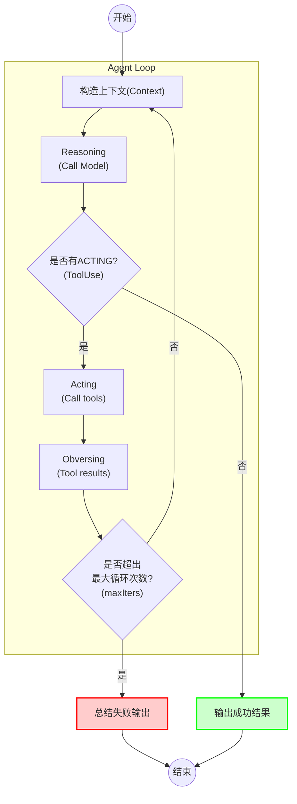
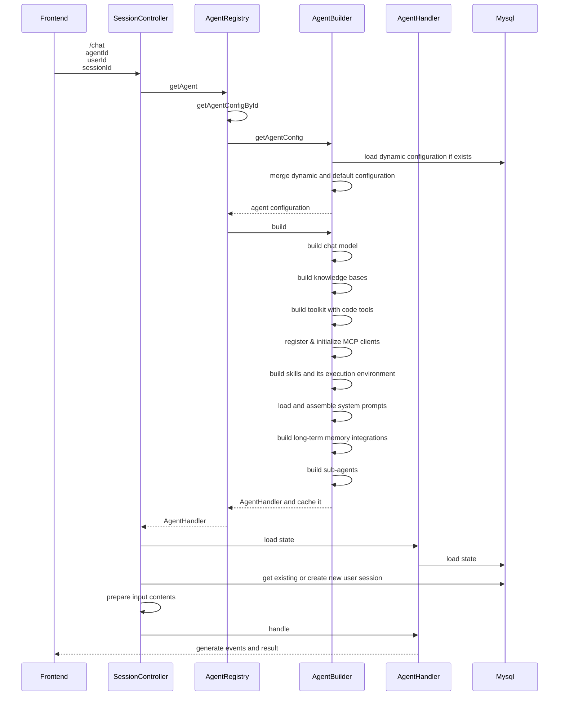
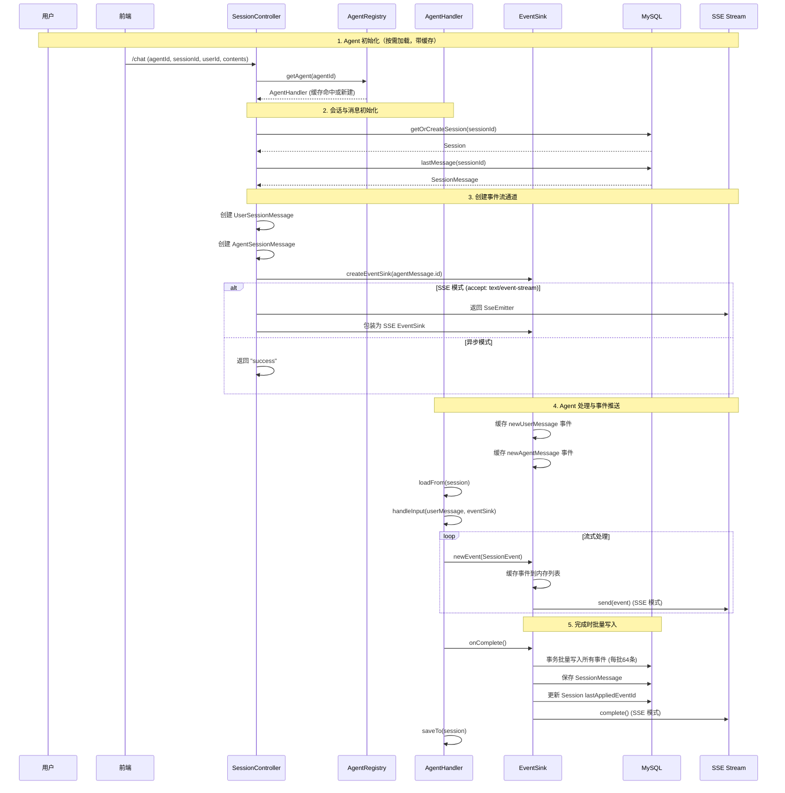

# 开发指南

## 核心流程

OneAgent最核心的流程是Chat，以下是一次对话过程（SSE API）中的不同阶段，详细解释一下相关的过程和原理。

### ReAct Agent Loop

结合Agentscope的ReAct Agent原理，描述其单次运行的流程。



注: 单次Agent调用可能会涉及到多轮循环，最终输出一个成功/失败的结果，OneAgent将其中Reasoning、Acting和Obersving的过程也通过异步事件的形式流式返回。

### Agent 初始化



- SessionController: 负责提供 /chat API，处理输入内容，驱动对话流程，返回响应(SSE)
- AgentRegistry: Agent注册表，负责管理并初始化应用内所有的Agent
- AgentBuilder：Agent构造器，负责加载Agent的配置，以及初始化AgentHandler
- AgentHandler：Agent实例，根据用户输入和智能体配置，产生流式输出和最终结果


### 异步事件流

OneAgent具备丰富的输入和输出内容支持，并且通过最多三层嵌套结构以灵活的支持不同的场景。


### Chat 完整流程



## API

OneAgent 提供运行时 API 用于会话管理和对话交互。

**基础路径**: `/api/agents/{agent_id}`（由 `server.servlet.context-path` 配置为 `/api`）

---

### 运行时 API

运行时 API 用于会话管理和对话交互，路径前缀：`/agents/{agent_id}`

#### 1. 创建会话

**Path**: `POST /agents/{agent_id}/sessions`

**用途**: 为指定 Agent 创建新会话

**路径参数**:

| 参数 | 类型 | 必填 | 说明 |
|------|------|------|------|
| agent_id | string | 是 | Agent ID |

**请求头**:

| 参数 | 类型 | 必填 | 说明 |
|------|------|------|------|
| X-User-Id | string | 是 | 用户 ID |

**请求体**:

| 字段 | 类型 | 必填 | 说明 |
|------|------|------|------|
| name | string | 是 | 会话名称 |

**返回值**: 会话 ID（字符串）

**示例**:

```bash
curl -X POST http://localhost:8080/api/agents/one_agent/sessions \
  -H "Content-Type: application/json" \
  -H "X-User-Id: test_user" \
  -d '{"name":"测试会话"}'
```

```json
"b6aa5fad7ff84271b59a897baa159d26"
```

#### 2. 获取会话列表

**Path**: `GET /agents/{agent_id}/sessions`

**用途**: 分页获取用户的会话列表

**路径参数**:

| 参数 | 类型 | 必填 | 说明 |
|------|------|------|------|
| agent_id | string | 是 | Agent ID |

**请求头**:

| 参数 | 类型 | 必填 | 说明 |
|------|------|------|------|
| X-User-Id | string | 是 | 用户 ID |

**查询参数**:

| 参数 | 类型 | 必填 | 默认值 | 说明 |
|------|------|------|--------|------|
| pageNo | int | 否 | 1 | 页码（从 1 开始） |
| pageSize | int | 否 | 10 | 每页数量（1-100） |

**返回值**:

| 字段 | 类型 | 说明 |
|------|------|------|
| totalRecords | int | 总记录数 |
| records | array | 会话列表 |
| pageNum | int | 当前页码 |
| pageSize | int | 每页数量 |
| totalPages | int | 总页数 |

**示例**:

```bash
curl http://localhost:8080/api/agents/one_agent/sessions \
  -H "X-User-Id: test_user"
```

```json
{
  "totalRecords": 1,
  "records": [
    {
      "id": "b6aa5fad7ff84271b59a897baa159d26",
      "name": "测试会话",
      "lastAppliedEventId": 0,
      "gmtCreated": "2026-04-08 11:24:54",
      "gmtModified": "2026-04-08 11:24:54"
    }
  ],
  "pageNum": 1,
  "pageSize": 10,
  "totalPages": 1
}
```

#### 3. 获取会话详情

**Path**: `GET /agents/{agent_id}/sessions/{session_id}`

**用途**: 获取指定会话的详细信息（包含消息列表）

**路径参数**:

| 参数 | 类型 | 必填 | 说明 |
|------|------|------|------|
| agent_id | string | 是 | Agent ID |
| session_id | string | 是 | 会话 ID |

**请求头**:

| 参数 | 类型 | 必填 | 说明 |
|------|------|------|------|
| X-User-Id | string | 是 | 用户 ID |

**返回值**: 会话详情（包含 messages 字段）

**示例**:

```bash
curl http://localhost:8080/api/agents/one_agent/sessions/b6aa5fad7ff84271b59a897baa159d26 \
  -H "X-User-Id: test_user"
```

```json
{
  "id": "b6aa5fad7ff84271b59a897baa159d26",
  "userId": "test_user",
  "agentId": "one_agent",
  "name": "测试会话",
  "lastAppliedEventId": 0,
  "gmtCreated": "2026-04-08 11:24:54",
  "gmtModified": "2026-04-08 11:24:54",
  "messages": {
    "totalRecords": 0,
    "records": [],
    "pageNum": 1,
    "pageSize": 10,
    "totalPages": 0
  }
}
```

#### 4. 删除会话

**Path**: `DELETE /agents/{agent_id}/sessions/{session_id}`

**用途**: 删除指定会话

**路径参数**: 同上

**请求头**: 同上

#### 5. 获取会话消息列表

**Path**: `GET /agents/{agent_id}/sessions/{session_id}/messages`

**用途**: 分页获取会话的消息列表

**查询参数**:

| 参数 | 类型 | 必填 | 默认值 | 说明 |
|------|------|------|--------|------|
| pageNo | int | 否 | 1 | 页码 |
| pageSize | int | 否 | 10 | 每页数量 |

**返回值**: 分页消息列表

#### 6. 获取会话事件列表

**Path**: `GET /agents/{agent_id}/sessions/{session_id}/events`

**用途**: 分页获取会话的事件列表（Event Sourcing 模式）

**查询参数**:

| 参数 | 类型 | 必填 | 默认值 | 说明 |
|------|------|------|--------|------|
| offset | long | 否 | 0 | 偏移量 |
| size | int | 否 | 10 | 获取数量（1-100） |

**返回值**: 事件列表（SessionEvent 数组）

#### 7. 发起对话（核心 API）

**Path**: `POST /agents/{agent_id}/sessions/{session_id}/chat`

**用途**: 向 Agent 发送消息并获取响应

**路径参数**:

| 参数 | 类型 | 必填 | 说明 |
|------|------|------|------|
| agent_id | string | 是 | Agent ID |
| session_id | string | 是 | 会话 ID |

**请求头**:

| 参数 | 类型 | 必填 | 说明 |
|------|------|------|------|
| X-User-Id | string | 是 | 用户 ID |
| X-User-Name | string | 否 | 用户名称 |
| Accept | string | 否 | 响应格式：`text/event-stream`（SSE 流式）或省略（异步） |

**请求体**:

| 字段 | 类型 | 必填 | 说明 |
|------|------|------|------|
| input | array | 是 | 输入内容列表 |

**input 数组元素**:

| 字段 | 类型 | 必填 | 说明 |
|------|------|------|------|
| type | int | 是 | 内容类型：1=文本，3=图片，4=视频，5=音频 |
| text | string | 条件 | 文本内容（type=1 时必填） |
| url | string | 条件 | 媒体 URL（type=3/4/5 时必填） |
| base64Data | string | 条件 | 媒体 Base64 数据（type=3/4/5 时可选） |

**响应模式**:

1. **SSE 流式模式**（推荐）: 设置 `Accept: text/event-stream`，返回 Server-Sent Events 流
2. **异步模式**: 不设置 Accept 头，立即返回 "success"，后台处理

**SSE 事件类型**:

- `NEW_USER_INPUT` (10): 用户输入事件
- `NEW_AGENT_MESSAGE` (20): 新 Agent 消息事件
- `AGENT_MESSAGE_APPEND_CONTENT` (21): Agent 消息内容追加
- `AGENT_MESSAGE_STATUS_CHANGED` (22): Agent 消息状态变更
- `TASK_APPEND_CONTENT` (30): 任务内容追加
- `TASK_STATUS_CHANGED` (31): 任务状态变更
- `ACTION_APPEND_CONTENT` (40): 动作内容追加
- `ACTION_STATUS_CHANGED` (41): 动作状态变更

**示例（SSE 模式）**:

```bash
curl -N -X POST http://localhost:8080/api/agents/one_agent/sessions/b6aa5fad7ff84271b59a897baa159d26/chat \
  -H "Content-Type: application/json" \
  -H "X-User-Id: test_user" \
  -H "Accept: text/event-stream" \
  -d '{"input":[{"type":1,"text":"你好"}]}'
```

**SSE 流输出示例**:

```
event:NEW_AGENT_MESSAGE
data:{"id":2,"agentId":"one_agent","userId":"test_user","sessionId":"b6aa5fad7ff84271b59a897baa159d26","msg":{"id":2,"status":"EXECUTING","gmtCreate":"2026-04-08 11:30:00"},"type":20}

event:AGENT_MESSAGE_APPEND_CONTENT
data:{"id":3,"agentId":"one_agent","userId":"test_user","sessionId":"b6aa5fad7ff84271b59a897baa159d26","messageId":2,"newContents":[{"id":1,"type":1,"text":"你好！"}],"type":21}

event:AGENT_MESSAGE_STATUS_CHANGED
data:{"id":4,"agentId":"one_agent","userId":"test_user","sessionId":"b6aa5fad7ff84271b59a897baa159d26","messageId":2,"newStatus":"SUCCEED","gmtFinished":"2026-04-08 11:30:05","type":22}
```

---

## Tables

## 模型配置

## Tool开发&注册

## 知识库集成

## 长期记忆集成

## MCP Server集成

## 添加 Skills

## 多模态集成

### 图片输入

### 语音转文字（ASR）

### 文字转语音（TTS）
