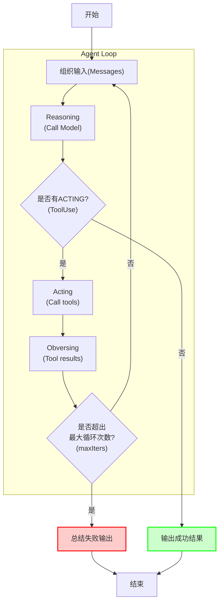
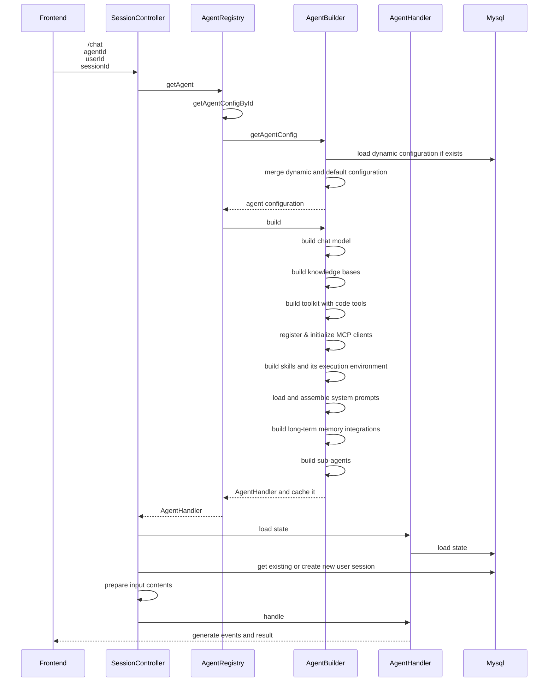
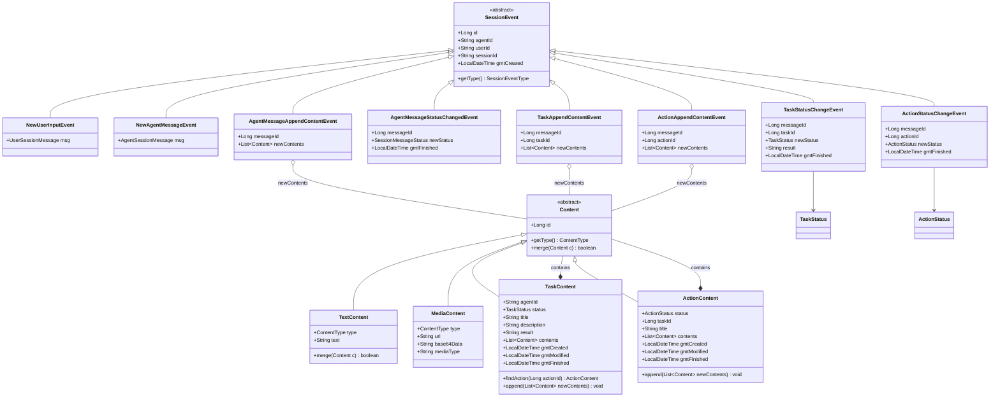
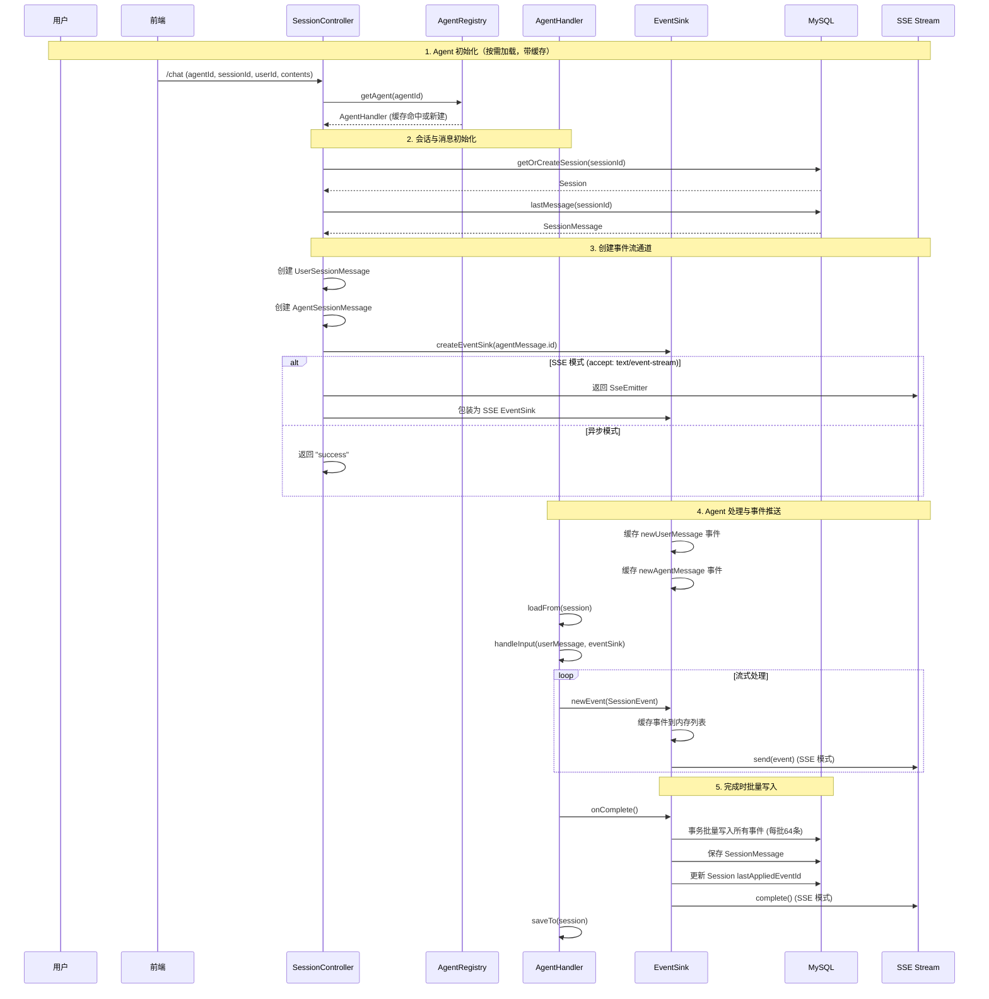

# 开发指南

## 核心流程

OneAgent最核心的流程是Chat，以下是一次对话过程（SSE API）中的不同阶段，详细解释一下相关的过程和原理。

### ReAct Agent Loop

结合Agentscope的ReAct Agent原理，描述其单次运行的流程。

注: 单次Agent调用可能会涉及到多轮循环，最终输出一个成功/失败的结果，OneAgent将其中Reasoning、Acting和Obersving的过程也通过异步事件的形式流式返回。

### Agent 初始化

- SessionController: 负责提供 /chat API，处理输入内容，驱动对话流程，返回响应(SSE)
- AgentRegistry: Agent注册表，负责管理并初始化应用内所有的Agent
- AgentBuilder：Agent构造器，负责加载Agent的配置，以及初始化AgentHandler
- AgentHandler：Agent实例，根据用户输入和智能体配置，产生流式输出和最终结果

### 异步事件流

OneAgent具备丰富的输入和输出内容支持，并且通过最多三层嵌套结构以灵活的支持不同的场景。

### Chat 完整流程

## API

## Tables

## 模型配置

## Tool开发&注册

## 知识库集成

## 长期记忆集成

## MCP Server集成

## 添加 Skills

## 多模态集成

### 图片输入

### 语音转文字（ASR）

### 文字转语音（TTS）
